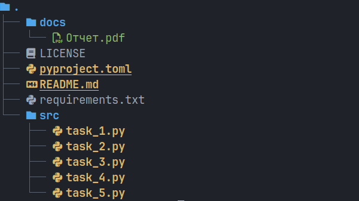

# Лабораторная работа №9 (4.8)
**Предмет** Объектно-ориентированное программирование  
**Тема:** Обработка событий и рисование в Tkinter  
**Вариант:** 8  

## Содержание

1. [Описание работы](#описание-работы)  
2. [Ссылка на отчет](#ссылка-на-отчет)  
3. [Структура репозитория](#структура-репозитория)  
4. [Задания](#задания)  

---

## Описание работы

Приобретение навыков улучшения графического интерфейса пользователя GUI с помощью обработки событий и рисования, реализованных в пакете Tkinter языка программирования Python версии 3.x.

---

## Ссылка на отчет

[Отчет о выполнении лабораторной работы](docs/Отчет.pdf)

---

## Структура репозитория



- `src/` — исходный код программы  
- `docs/` — отчет по лабораторной работе  
- `assets/` — вспомогательные изображения
- `.pre-commit-config.yaml` — конфигурация pre-commit
- `requirements.txt` — список зависимостей

---

## Задания

### Задание №1  
[Исходный код задания](src/task_1.py)  

Решите задачу: напишите программу, состоящую из двух списков Listbox . В первом будет, например, перечень товаров, заданный программно. Второй изначально пуст, пусть это будет перечень покупок. При клике на одну кнопку товар должен переходить из одного списка в другой. При клике на вторую кнопку – возвращаться (человек передумал покупать). Предусмотрите возможность множественного выбора элементов списка и их перемещения.

### Задание №2  
[Исходный код задания](src/task_2.py)  

Решите задачу: напишите программу по следующему описанию. Нажатие Enter в однострочном текстовом поле приводит к перемещению текста из него в список (экземпляр Listbox ). При двойном клике ( <Double-Button-1> ) по элементу-строке списка, она должна копироваться в текстовое поле.

### Задание №3 
[Исходный код задания](src/task_3.py)  

Решите задачу: напишите программу по описанию. Размеры многострочного текстового поля определяются значениями, введенными в однострочные текстовые поля. Изменение размера происходит при нажатии мышью на кнопку, а также при нажатии клавиши Enter. Цвет фона экземпляра Text светлосерый ( lightgrey ), когда поле не в фокусе, и белый, когда имеет фокус. Событие получения фокуса обозначается как <FocusIn> , потери – как <FocusOut> . Для справки: фокус перемещается по виджетам при нажатии Tab, Ctrl+Tab, Shift+Tab, а также при клике по ним мышью (к кнопкам последнее не относится).

### Задание №4
[Исходный код задания](src/task_4.py)

Создайте на холсте изображение домика.

### Задание №5
[Исходный код задания](src/task_4.py)

Решите задачу: в данной программе создается анимация круга, который движется от левой границы холста до правой:

```python
from tkinter import *

def motion():
    c.move(ball, 1, 0)
    if c.coords(ball)[2] < 300:
        root.after(10, motion)

root = Tk()
c = Canvas(root, width=300, height=200,
bg="white")
c.pack()
ball = c.create_oval(0, 100, 40, 140,
fill='green')
motion()
root.mainloop()
```

Выражение c.coords(ball) возвращает список текущих координат объекта (в данном случае это ball). Третий элемент списка соответствует его второй координате x. Метод after вызывает функцию, переданную вторым аргументом, через количество миллисекунд, указанных первым аргументом.
Изучите приведенную программу и самостоятельно запрограммируйте постепенное движение фигуры в ту точку холста, где пользователь кликает левой кнопкой мыши. Координаты события хранятся в его атрибутах x и y ( event.x , event.y ).
